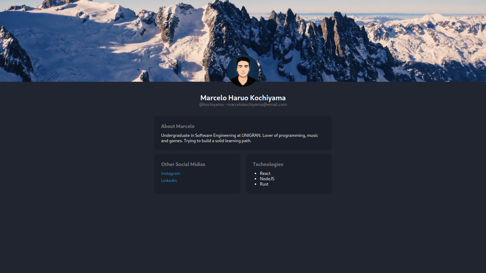

# Styled Profile

Simple profile page, built with styled components. The idea is to take a look on
how to use styled-components in practice.

A little bit of responsiviness was added too.

## Objective

- Understand how to implement some styled-components
- Understand how to make responsive styled-components

This project was bootstrapped with
[Create React App](https://github.com/facebook/create-react-app).

## Available Scripts

In the project directory, you can run:

### `yarn start`

Runs the app in the development mode.\
Open [http://localhost:3000](http://localhost:3000) to view it in the browser.

The page will reload if you make edits.\
You will also see any lint errors in the console.
